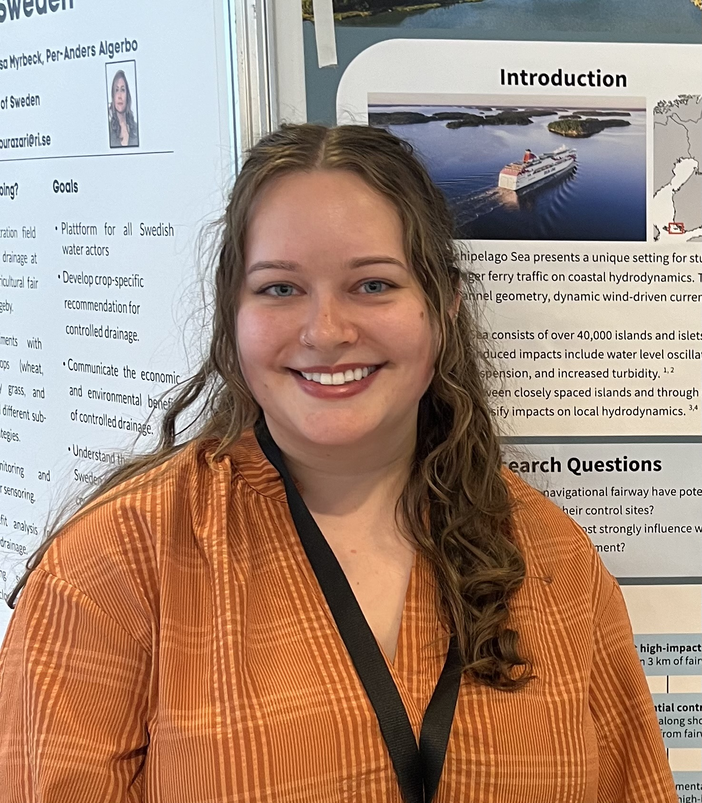
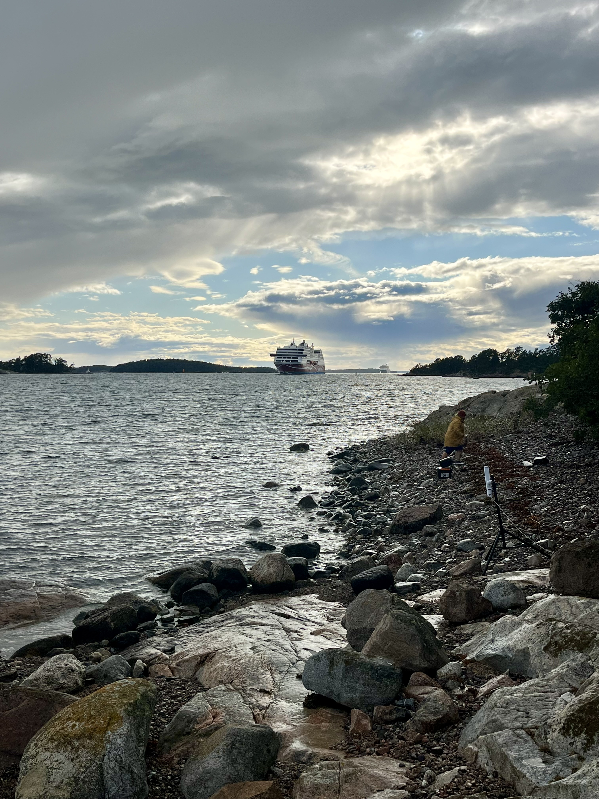
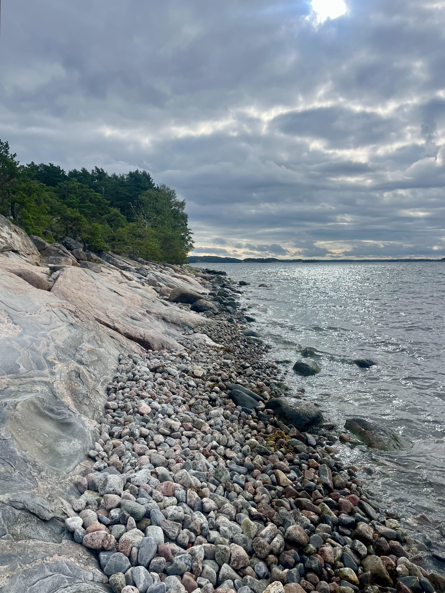

# **Portfolio: Mariah Josten**

I'm originally from Seattle in Washington State, USA.

I have a Bachelor's in oceanography from the University of Washington.

I have a Master's in coastal hazards and adaptations from IHE Delft in the Netherlands.

Currently, I'm a doctoral researcher at the University of Turku in Finland studying the impacts of ferries on hydrodynamics in coastal areas.

My hobbies include: knitting, crochet, yoga, and swimming.

